# Due Social

**Due Social** is a social media application backend and frontend that allows users to register, login, create posts, like posts, and reply to posts. It features a secure authentication system using JWT and a responsive UI.

## Technologies

*   **Node.js**: Runtime environment.
*   **Express**: Web framework for Node.js.
*   **MongoDB**: NoSQL database for storing users and posts.
*   **Mongoose**: ODM library for MongoDB and Node.js.
*   **JWT (JSON Web Token)**: Secure user authentication.
*   **bcryptjs**: Password hashing.
*   **Render**: Cloud platform for deployment.
*   **Postman**: API testing and documentation.

## Setup

1.  **Clone the repository:**
    ```bash
    git clone https://github.com/duesenbek/due-social.git
    cd due-social
    ```

2.  **Install dependencies:**
    ```bash
    npm install
    ```

3.  **Configure Environment Variables:**
    Create a `.env` file in the root directory and add the following:
    ```env
    PORT=5000
    MONGO_URI=your_mongodb_connection_string
    JWT_SECRET=your_jwt_secret_key
    ```

4.  **Start the server:**
    ```bash
    npm start
    ```
    Or for development:
    ```bash
    npm run dev
    ```

## API Documentation

### Auth
*   **Register**: `POST /api/auth/register`
    *   Body: `{ "name": "User", "email": "user@example.com", "password": "password" }`
*   **Login**: `POST /api/auth/login`
    *   Body: `{ "email": "user@example.com", "password": "password" }`

### Users
*   **Get Profile**: `GET /api/users/profile` (Requires Auth)
*   **Update Profile**: `PUT /api/users/profile` (Requires Auth)
    *   Body: `{ "name": "New Name", "email": "newemail@example.com" }`

### Posts
*   **Get All Posts**: `GET /api/posts`
*   **Create Post**: `POST /api/posts` (Requires Auth)
    *   Body: `{ "content": "Hello World" }`
*   **Like Post**: `PUT /api/posts/like` (Requires Auth)
    *   Body: `{ "postId": "post_id" }`
*   **Reply to Post**: `POST /api/posts` (Requires Auth)
    *   Body: `{ "content": "This is a reply", "replyTo": "parent_post_id" }`
*   **Delete Post**: `DELETE /api/posts/:id` (Requires Auth)

### Validation / Error Handling
Validation is implemented manually inside controllers (e.g. required fields, email/password checks).

Errors are handled with proper HTTP status codes:
*   **400** – Bad Request
*   **401** – Unauthorized
*   **404** – Not Found
*   **500** – Server Error

## Features

*   **Register**: Create a new user account.
*   **Login**: Authenticate existing users and receive a JWT.
*   **JWT Auth**: Secure routes protected by JSON Web Tokens.
*   **Create Post**: Users can publish text-based posts.
*   **Like**: Users can like and unlike posts.
*   **Reply**: Users can reply to existing posts (threaded comments).
*   **Delete**: Users can delete their own posts and replies.
*   **Protected Routes**: API endpoints that require authentication.

## Deployment

**Render URL**: [https://due-social.onrender.com](https://due-social.onrender.com)

> **Note**: This deployment relies on Environment Variables (`PORT`, `MONGO_URI`, `JWT_SECRET`) which must be configured in the deployment platform settings.

## Screenshots

### Deployment
**Render Dashboard**
Shows the active deployment of the Due Social backend on Render, indicating a healthy service status.
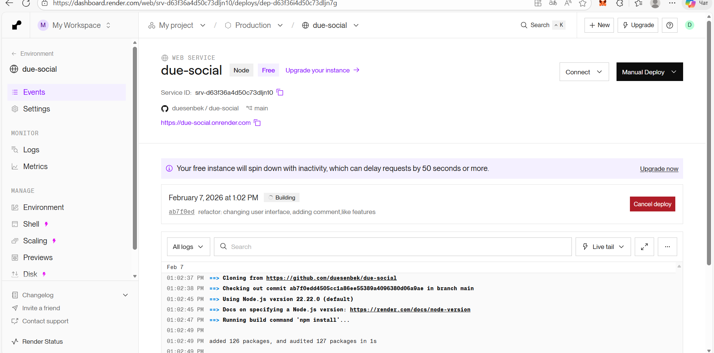

### Database (MongoDB)
**Clusters Overview**
Overview of the MongoDB Atlas cluster "Cluster0" hosted on AWS, showing the region and tier.


**Posts Collection**
Data Explorer view of the `posts` collection, storing user-generated content including text and author references.
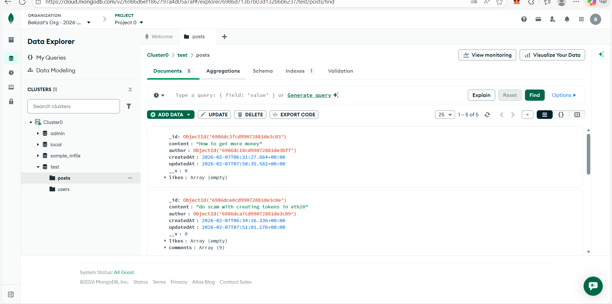

**Users Collection**
Data Explorer view of the `users` collection, showing registered users with hashed passwords.


### Application UI
**Login Page**
Secure login interface where users can authenticate using their email and password.


**Register Page**
Registration form for new users to sign up by providing their name, email, and password.
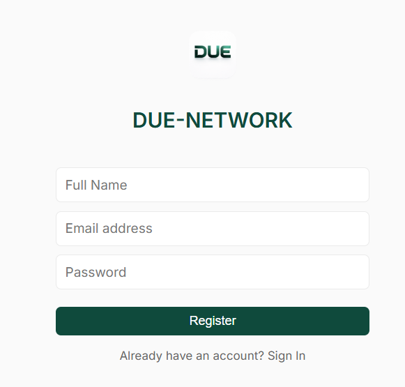

**Feed Page**
The main social feed displaying posts from all users throughout the network.
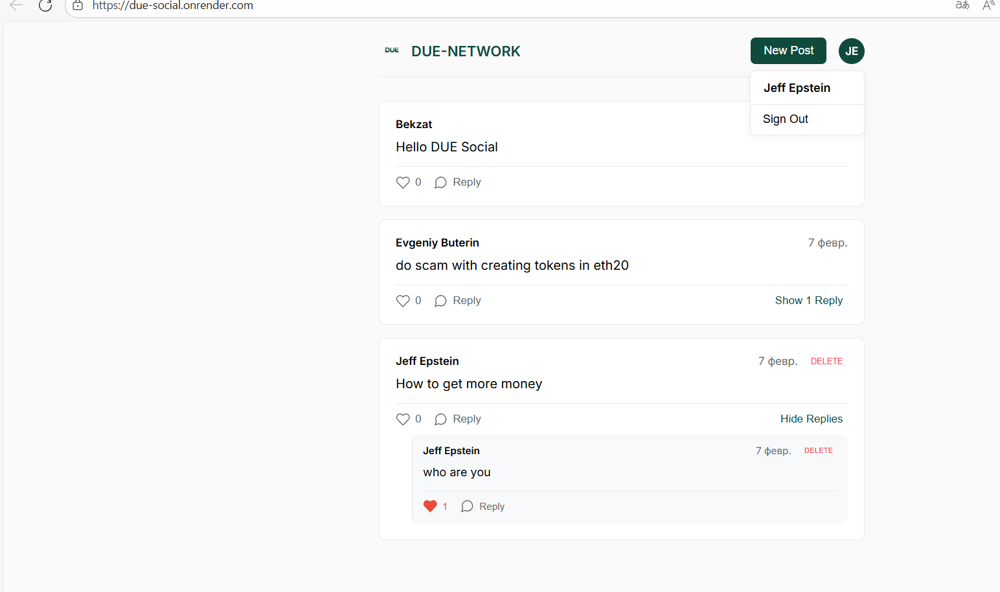

### API Testing (Postman)
**Register User**
API request to register a new user, returning the created user object.
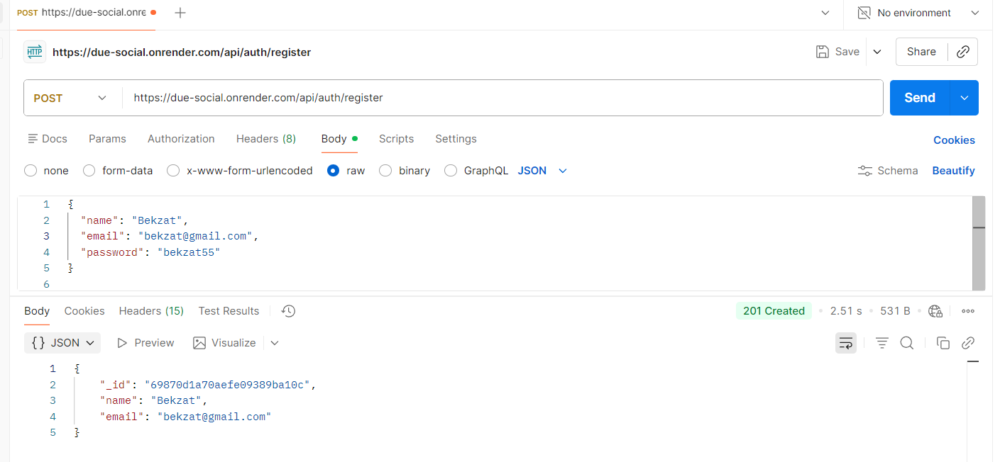

**Login User (Token Response)**
API request to login, returning a JWT for authenticated session management.
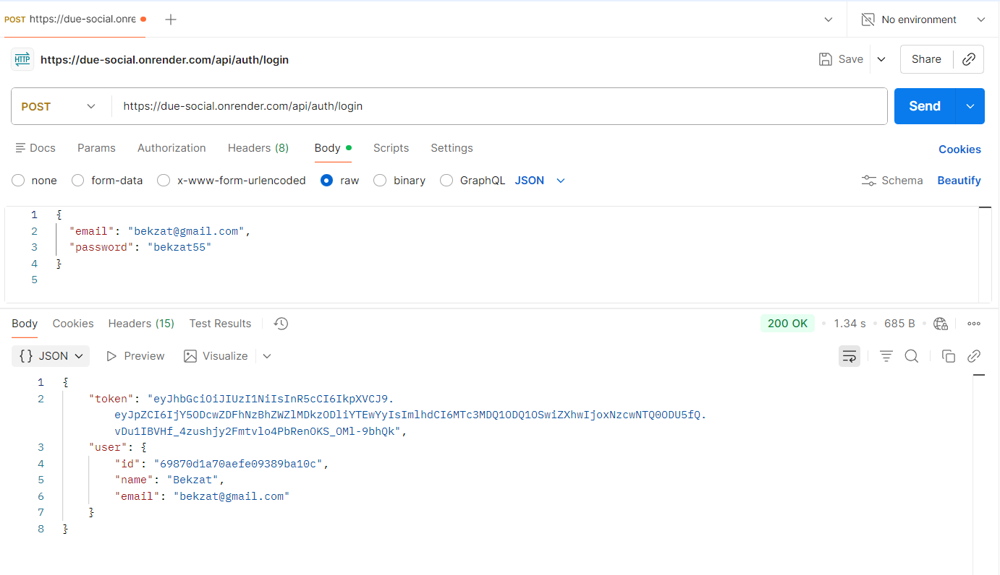

**Get Profile**
Authenticated request to fetch the current user's profile information.
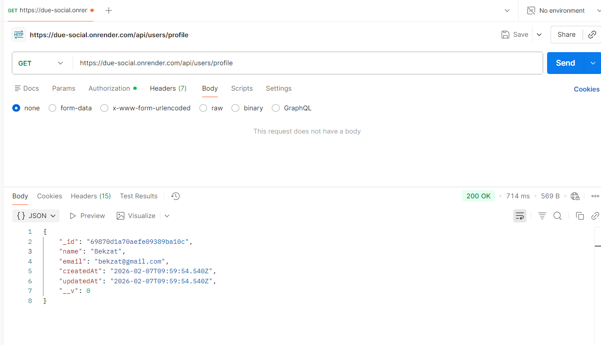

**Update Profile**
Authenticated request to update the user's profile (name/gmail).
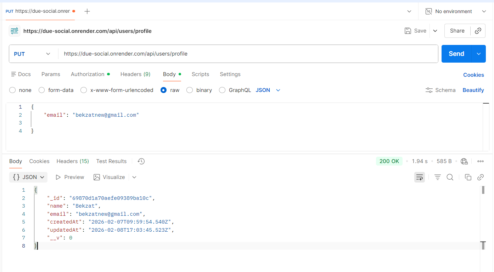

**Create Post**
Authenticated request to create a new post.
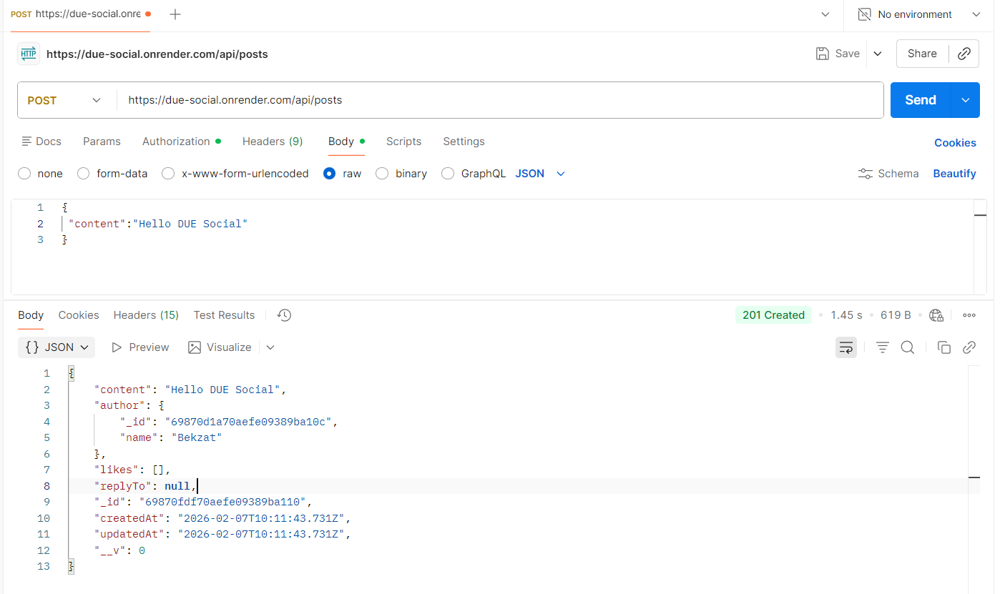

**Get Posts**
Request to fetch all posts, including populated author details.


**Like Post**
Authenticated request to like a specific post.
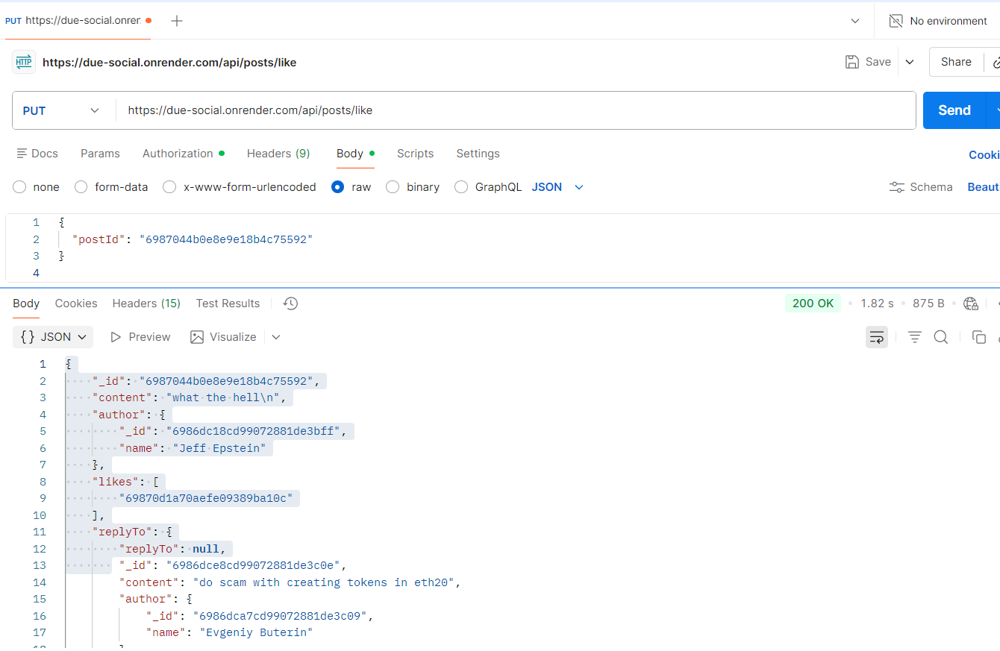

**Reply to Post**
Creating a reply to an existing post, demonstrating the threading capability.
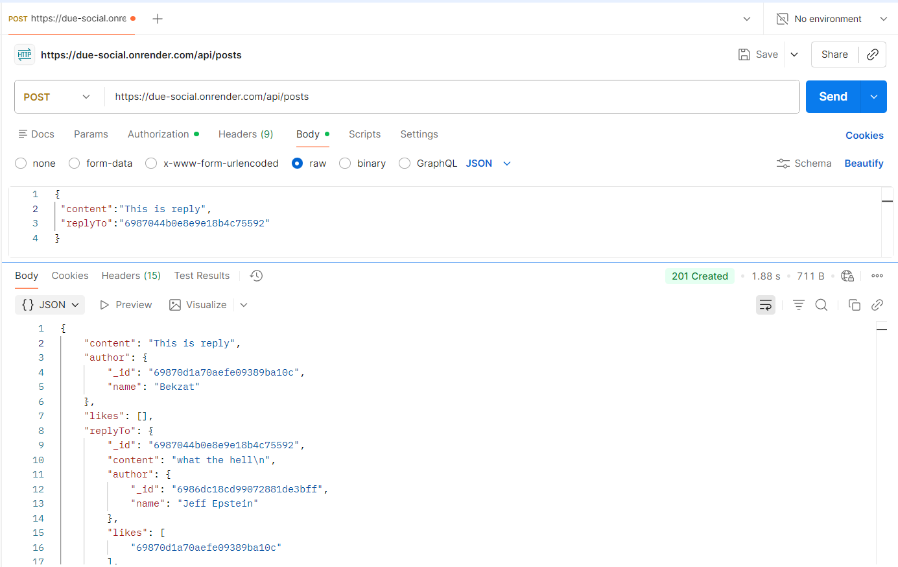

**Delete Post**
Authenticated request to delete a user's own post.
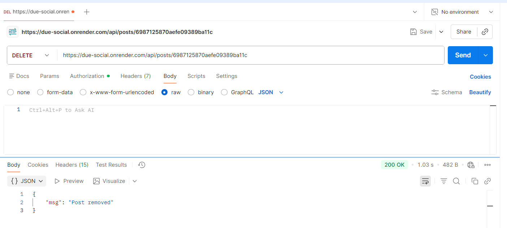
